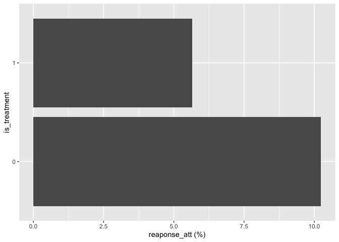
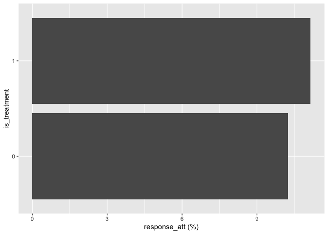

# 2_A/Bテストを用いてクリーンに効果検証を行う
topazape

# 前準備

``` r
library(tidyverse)
```

    ── Attaching core tidyverse packages ──────────────────────── tidyverse 2.0.0 ──
    ✔ dplyr     1.1.4     ✔ readr     2.1.5
    ✔ forcats   1.0.0     ✔ stringr   1.5.1
    ✔ ggplot2   3.5.1     ✔ tibble    3.2.1
    ✔ lubridate 1.9.3     ✔ tidyr     1.3.1
    ✔ purrr     1.0.2     
    ── Conflicts ────────────────────────────────────────── tidyverse_conflicts() ──
    ✖ dplyr::filter() masks stats::filter()
    ✖ dplyr::lag()    masks stats::lag()
    ℹ Use the conflicted package (<http://conflicted.r-lib.org/>) to force all conflicts to become errors

``` r
URL_CH2_LOGDATA <- "https://raw.githubusercontent.com/HirotakeIto/intro_to_impact_evaluation_with_python/main/data/ch2_logdata.csv"
URL_LENTA_DATA <- "https://raw.githubusercontent.com/HirotakeIto/intro_to_impact_evaluation_with_python/main/data/lenta_dataset.csv"
```

# Prelude

## プログラム2.1 太郎くんの分析の再現

``` r
df <- read_csv(URL_CH2_LOGDATA)
```

    Rows: 35530 Columns: 5
    ── Column specification ────────────────────────────────────────────────────────
    Delimiter: ","
    dbl (5): is_treatment, response_att, food_share_15d, age, is_women

    ℹ Use `spec()` to retrieve the full column specification for this data.
    ℹ Specify the column types or set `show_col_types = FALSE` to quiet this message.

``` r
df |>
  group_by(is_treatment) |>
  summarise(
    response_att = mean(response_att) * 100
  ) -> df_result

df_result
```

    # A tibble: 2 × 2
      is_treatment response_att
             <dbl>        <dbl>
    1            0        10.2 
    2            1         5.66

``` r
df_result |>
  ggplot(aes(x = response_att, y = factor(is_treatment))) +
  geom_col() +
  labs(x = "reaponse_att (%)", y = "is_treatment")
```



# A/B テストの基本的な発想

``` r
read_csv(URL_LENTA_DATA) |>
  group_by(is_treatment) |>
  summarise(
    food_share_15d = mean(food_share_15d) * 100
  )
```

    Rows: 50000 Columns: 5
    ── Column specification ────────────────────────────────────────────────────────
    Delimiter: ","
    dbl (5): is_treatment, response_att, food_share_15d, age, is_women

    ℹ Use `spec()` to retrieve the full column specification for this data.
    ℹ Specify the column types or set `show_col_types = FALSE` to quiet this message.

    # A tibble: 2 × 2
      is_treatment food_share_15d
             <dbl>          <dbl>
    1            0           34.6
    2            1           34.9

# A/B テストの設計と分析

## A/B テストの設計

### 割当

#### プログラム2.2 ランダム割当

``` r
set.seed(0)
is_treatment <- sample(c(0, 1), size = 1, prob = c(0.3, 0.7), replace = TRUE)
is_treatment
```

    [1] 0

#### プログラム2.3 ハッシュ化を通じたランダム割当

``` r
library(digest)
uid <- "hogehoge"
salt <- "salt0_"
hash_value <- digest(paste0(salt, uid), algo = "sha256")
hash_value_int <- as.numeric(paste0("0x", hash_value))

if ((hash_value_int %% 10) < 3) {
  is_treatment <- 1
} else {
  is_treatment <- 0
}
```

    Warning: probable complete loss of accuracy in modulus

``` r
is_treatment
```

    [1] 0

# A/B テスト

## 太郎くんのストーリーにある図表の再現

``` r
df_result_response <- read_csv(URL_LENTA_DATA) |>
  group_by(is_treatment) |>
  summarise(
    response_att = mean(response_att) * 100
  )
```

    Rows: 50000 Columns: 5
    ── Column specification ────────────────────────────────────────────────────────
    Delimiter: ","
    dbl (5): is_treatment, response_att, food_share_15d, age, is_women

    ℹ Use `spec()` to retrieve the full column specification for this data.
    ℹ Specify the column types or set `show_col_types = FALSE` to quiet this message.

``` r
df_result_response
```

    # A tibble: 2 × 2
      is_treatment response_att
             <dbl>        <dbl>
    1            0         10.2
    2            1         11.1

``` r
df_result_response |>
  ggplot(aes(x = response_att, y = factor(is_treatment))) +
  geom_col() +
  labs(x = "response_att (%)", y = "is_treatment")
```



# R によるプッシュ通知施策効果の検証

``` r
df <- read_csv(URL_LENTA_DATA)
```

    Rows: 50000 Columns: 5
    ── Column specification ────────────────────────────────────────────────────────
    Delimiter: ","
    dbl (5): is_treatment, response_att, food_share_15d, age, is_women

    ℹ Use `spec()` to retrieve the full column specification for this data.
    ℹ Specify the column types or set `show_col_types = FALSE` to quiet this message.

``` r
df_balance_test <- df |>
  group_by(is_treatment) |>
  summarise(
    food_share_15d = mean(food_share_15d),
    age = mean(age, na.rm = TRUE),
    is_women = mean(is_women)
  )
df_balance_test
```

    # A tibble: 2 × 4
      is_treatment food_share_15d   age is_women
             <dbl>          <dbl> <dbl>    <dbl>
    1            0          0.346  43.6    0.619
    2            1          0.349  43.8    0.630

``` r
df |>
  lm(data = _, response_att ~ is_treatment) |>
  summary()
```


    Call:
    lm(formula = response_att ~ is_treatment, data = df)

    Residuals:
        Min      1Q  Median      3Q     Max 
    -0.1115 -0.1115 -0.1115 -0.1024  0.8976 

    Coefficients:
                 Estimate Std. Error t value Pr(>|t|)    
    (Intercept)  0.102364   0.002811  36.412  < 2e-16 ***
    is_treatment 0.009095   0.003238   2.809  0.00497 ** 
    ---
    Signif. codes:  0 '***' 0.001 '**' 0.01 '*' 0.05 '.' 0.1 ' ' 1

    Residual standard error: 0.3119 on 49998 degrees of freedom
    Multiple R-squared:  0.0001578, Adjusted R-squared:  0.0001378 
    F-statistic:  7.89 on 1 and 49998 DF,  p-value: 0.004974
