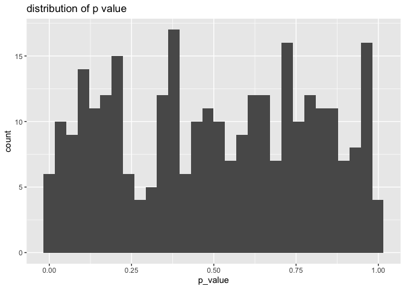
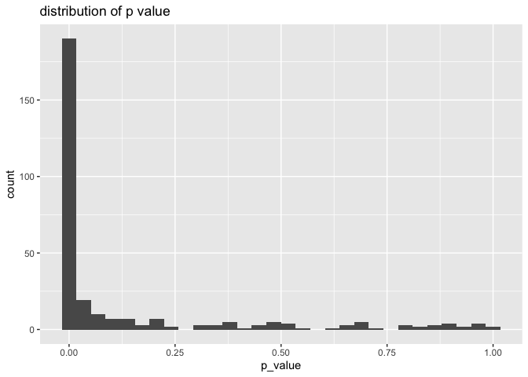
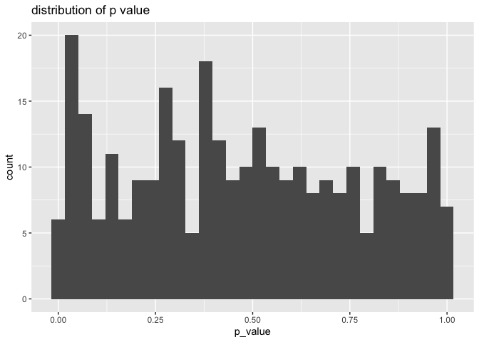
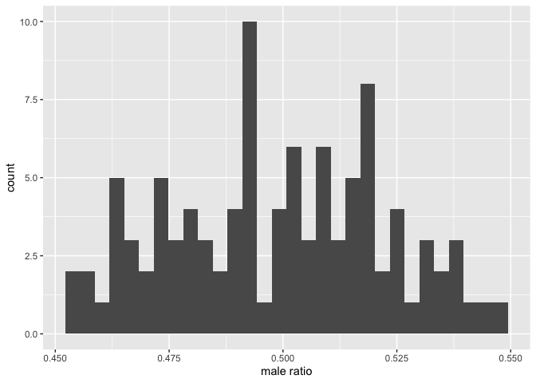

# 3_A/Bテストを用いて実務制約内で効果検証を行う


# 前準備

``` r
library(tidyverse)
```

    ── Attaching core tidyverse packages ──────────────────────── tidyverse 2.0.0 ──
    ✔ dplyr     1.1.4     ✔ readr     2.1.5
    ✔ forcats   1.0.0     ✔ stringr   1.5.1
    ✔ ggplot2   3.5.1     ✔ tibble    3.2.1
    ✔ lubridate 1.9.3     ✔ tidyr     1.3.1
    ✔ purrr     1.0.2     
    ── Conflicts ────────────────────────────────────────── tidyverse_conflicts() ──
    ✖ dplyr::filter() masks stats::filter()
    ✖ dplyr::lag()    masks stats::lag()
    ℹ Use the conflicted package (<http://conflicted.r-lib.org/>) to force all conflicts to become errors

``` r
library(broom)
library(digest)

URL_LENTA_DATA <- "https://raw.githubusercontent.com/HirotakeIto/intro_to_impact_evaluation_with_python/main/data/lenta_dataset.csv"
URL_CLUSTER_TRIAL <- "https://raw.githubusercontent.com/HirotakeIto/intro_to_impact_evaluation_with_python/main/data/ch3_cluster_trial.csv"
URL_STRATIFIED_TRIAL <- "https://raw.githubusercontent.com/HirotakeIto/intro_to_impact_evaluation_with_python/main/data/ch3_stratified_trial.csv"
URL_AATEST <- "https://raw.githubusercontent.com/HirotakeIto/intro_to_impact_evaluation_with_python/main/data/ch3_aatest_trial.csv"
URL_NONCOMPLIANCE <- "https://raw.githubusercontent.com/HirotakeIto/intro_to_impact_evaluation_with_python/main/data/ch3_noncompliance_abtest.csv"
URL_TITANIC <- "https://raw.githubusercontent.com/mwaskom/seaborn-data/master/titanic.csv"
```

# A/B テストについての発展的な話題

## A/A テスト：A/B テスト設計の妥当性を確認する

### プログラム3.1 割当単位と分析単位が不一致な場合の回帰分析

``` r
df_cluster_trial <- read_csv(URL_CLUSTER_TRIAL)
```

    Rows: 10640 Columns: 3
    ── Column specification ────────────────────────────────────────────────────────
    Delimiter: ","
    dbl (3): uid, is_treatment, is_click

    ℹ Use `spec()` to retrieve the full column specification for this data.
    ℹ Specify the column types or set `show_col_types = FALSE` to quiet this message.

``` r
df_cluster_trial |>
  lm(data = _, is_click ~ is_treatment) |>
  summary()
```


    Call:
    lm(formula = is_click ~ is_treatment, data = df_cluster_trial)

    Residuals:
        Min      1Q  Median      3Q     Max 
    -0.5216 -0.4984  0.4784  0.5016  0.5016 

    Coefficients:
                  Estimate Std. Error t value Pr(>|t|)    
    (Intercept)   0.521631   0.007503  69.521   <2e-16 ***
    is_treatment -0.023244   0.009828  -2.365    0.018 *  
    ---
    Signif. codes:  0 '***' 0.001 '**' 0.01 '*' 0.05 '.' 0.1 ' ' 1

    Residual standard error: 0.4999 on 10638 degrees of freedom
    Multiple R-squared:  0.0005256, Adjusted R-squared:  0.0004316 
    F-statistic: 5.594 on 1 and 10638 DF,  p-value: 0.01804

### プログラム3.2 A/A テストの分析（A/A テストが成功している時）

``` r
df_aatest <- read_csv(URL_AATEST)
```

    Rows: 10000 Columns: 3
    ── Column specification ────────────────────────────────────────────────────────
    Delimiter: ","
    dbl (3): imp_id, is_treatment, is_click

    ℹ Use `spec()` to retrieve the full column specification for this data.
    ℹ Specify the column types or set `show_col_types = FALSE` to quiet this message.

``` r
df_aatest |>
  lm(data = _, is_click ~ is_treatment) |>
  summary()
```


    Call:
    lm(formula = is_click ~ is_treatment, data = df_aatest)

    Residuals:
        Min      1Q  Median      3Q     Max 
    -0.5090 -0.4988  0.4910  0.4910  0.5012 

    Coefficients:
                 Estimate Std. Error t value Pr(>|t|)    
    (Intercept)  0.498793   0.007093  70.327   <2e-16 ***
    is_treatment 0.010154   0.010000   1.015     0.31    
    ---
    Signif. codes:  0 '***' 0.001 '**' 0.01 '*' 0.05 '.' 0.1 ' ' 1

    Residual standard error: 0.5 on 9998 degrees of freedom
    Multiple R-squared:  0.0001031, Adjusted R-squared:  3.088e-06 
    F-statistic: 1.031 on 1 and 9998 DF,  p-value: 0.31

### プログラム3.3 A/A テストのリプレイ

``` r
assign_treatment_randomly <- function(id, salt) {
  hash_value <- digest(
    paste0(salt, "_", id),
    algo = "sha256",
    serialize = FALSE
    )
  
  return(strtoi(substr(hash_value, 1, 8), base = 16) %% 2)
}
```

``` r
replays <- map_dbl(1:300, function(i) {
  salt <- paste0("salt", i)
  result <- df_aatest |>
    mutate(
      is_treatment_in_aa = map_int(
        imp_id, assign_treatment_randomly, salt = salt
      )
    ) |>
    lm(data = _, is_click ~ is_treatment_in_aa) |>
    tidy()
  
  return(result$p.value[2])
})
```

``` r
tibble(p_value = replays) |>
  ggplot(aes(x = p_value)) +
  geom_histogram() +
  labs(title = "distribution of p value")
```

    `stat_bin()` using `bins = 30`. Pick better value with `binwidth`.



### プログラム3.5 コルモゴロフ-スミルノフ検定による分布の確認

``` r
ks.test(replays, y = "punif")
```


        Asymptotic one-sample Kolmogorov-Smirnov test

    data:  replays
    D = 0.037912, p-value = 0.7816
    alternative hypothesis: two-sided

# 状況に応じた A/B テストのモデリング

## クラスター A/B テスト

### プログラム3.6 クラスターA/B テストデータにおける A/A テストのリプレイ

``` r
df_cluster_trial <- read_csv(URL_CLUSTER_TRIAL)
```

    Rows: 10640 Columns: 3
    ── Column specification ────────────────────────────────────────────────────────
    Delimiter: ","
    dbl (3): uid, is_treatment, is_click

    ℹ Use `spec()` to retrieve the full column specification for this data.
    ℹ Specify the column types or set `show_col_types = FALSE` to quiet this message.

``` r
df_cluster_trial |>
  group_by(uid) |>
  summarise(
    n = n(),
    click = sum(is_click),
    ctr = sum(is_click) / n()
  )
```

    # A tibble: 200 × 4
         uid     n click    ctr
       <dbl> <int> <dbl>  <dbl>
     1     0    85    32 0.376 
     2     1    64    10 0.156 
     3     2    51    34 0.667 
     4     3    27     5 0.185 
     5     4    31    11 0.355 
     6     5     5     5 1     
     7     6     8     8 1     
     8     7     2     2 1     
     9     8    18     1 0.0556
    10     9    81    63 0.778 
    # ℹ 190 more rows

``` r
replays <- map_dbl(1:300, function(i) {
  salt <- paste0("salt", i)
  result <- df_cluster_trial |>
    mutate(
      is_treatment_in_aa = map_int(
        uid, assign_treatment_randomly, salt = salt
      )
    ) |>
    lm(data = _, is_click ~ is_treatment_in_aa) |>
    tidy()

  return(result$p.value[2])
})
```

``` r
tibble(p_value = replays) |>
  ggplot(aes(x = p_value)) +
  geom_histogram() +
  labs(title = "distribution of p value")
```

    `stat_bin()` using `bins = 30`. Pick better value with `binwidth`.



``` r
ks.test(replays, y = "punif")
```


        Asymptotic one-sample Kolmogorov-Smirnov test

    data:  replays
    D = 0.64994, p-value < 2.2e-16
    alternative hypothesis: two-sided

### プログラム3.7 クラスター A/B テストデータの分析

``` r
library(estimatr)

df_cluster_trial <- read_csv(URL_CLUSTER_TRIAL)
```

    Rows: 10640 Columns: 3
    ── Column specification ────────────────────────────────────────────────────────
    Delimiter: ","
    dbl (3): uid, is_treatment, is_click

    ℹ Use `spec()` to retrieve the full column specification for this data.
    ℹ Specify the column types or set `show_col_types = FALSE` to quiet this message.

``` r
df_cluster_trial |>
  estimatr::lm_robust(
    is_click ~ is_treatment,
    data = _,
    clusters = uid,
    se_type = "stata"
    
  ) |> summary()
```


    Call:
    estimatr::lm_robust(formula = is_click ~ is_treatment, data = df_cluster_trial, 
        clusters = uid, se_type = "stata")

    Standard error type:  stata 

    Coefficients:
                 Estimate Std. Error t value  Pr(>|t|) CI Lower CI Upper  DF
    (Intercept)   0.52163    0.03337 15.6317 1.837e-36   0.4558  0.58744 199
    is_treatment -0.02324    0.04312 -0.5391 5.904e-01  -0.1083  0.06178 199

    Multiple R-squared:  0.0005256 ,    Adjusted R-squared:  0.0004316 
    F-statistic: 0.2906 on 1 and 199 DF,  p-value: 0.5904

### プログラム3.8 クラスターA/BテストデータのA/Aテスト

``` r
replays <- map_dbl(1:300, function(i) {
  salt <- paste0("salt", i)
  result <- df_cluster_trial |>
    mutate(
      is_treatment_in_aa = map_int(
        uid, assign_treatment_randomly, salt = salt
      )
    ) |>
    estimatr::lm_robust(
      is_click ~ is_treatment_in_aa,
      data = _,
      clusters = uid,
      se_type = "stata"
      ) |>
    tidy()

  return(result$p.value[2])
})
```

``` r
tibble(p_value = replays) |>
  ggplot(aes(x = p_value)) +
  geom_histogram() +
  labs(title = "distribution of p value")
```

    `stat_bin()` using `bins = 30`. Pick better value with `binwidth`.



``` r
ks.test(replays, y = "punif")
```


        Asymptotic one-sample Kolmogorov-Smirnov test

    data:  replays
    D = 0.05711, p-value = 0.2818
    alternative hypothesis: two-sided

# 層化 A/B テスト

### プログラム3.9 シミュレーション：ランダムな割り当てをした場合の性別の偏り

``` r
set.seed(0)
generate_sample <- function() {
  mean(sample(c(0, 1), size = 500, replace = TRUE, prob = c(0.5, 0.5)))
}

tibble(
  id = 1:100,
  value = map_dbl(id, ~ generate_sample())
) |>
  ggplot(aes(x = value)) +
  geom_histogram() +
  labs(
    x = "male ratio"
  )
```

    `stat_bin()` using `bins = 30`. Pick better value with `binwidth`.



### プログラム3.10 層化 A/B テストにおけるランダムな割り当て

``` r
set.seed(0)

df_titanic <- read_csv(URL_TITANIC) |>
  select(survived, sex, pclass)
```

    Rows: 891 Columns: 15
    ── Column specification ────────────────────────────────────────────────────────
    Delimiter: ","
    chr (7): sex, embarked, class, who, deck, embark_town, alive
    dbl (6): survived, pclass, age, sibsp, parch, fare
    lgl (2): adult_male, alone

    ℹ Use `spec()` to retrieve the full column specification for this data.
    ℹ Specify the column types or set `show_col_types = FALSE` to quiet this message.

``` r
label_with_prob <- function(prob) {
  sample(c(0, 1), size = 1, prob = c(1 - prob, prob))
}

df_titanic |>
  group_by(sex, pclass) |>
  mutate(
    is_treat = map_dbl(
      1:n(), ~ label_with_prob(0.3)
    )
  ) |> ungroup() -> df_titanic
```

#### プログラム3.11　サブグループごとの割当比率を確認する

``` r
df_titanic |>
  group_by(sex, pclass) |>
  summarise(
    mean_is_treat = mean(is_treat)
  )
```

    `summarise()` has grouped output by 'sex'. You can override using the `.groups`
    argument.

    # A tibble: 6 × 3
    # Groups:   sex [2]
      sex    pclass mean_is_treat
      <chr>   <dbl>         <dbl>
    1 female      1         0.309
    2 female      2         0.263
    3 female      3         0.264
    4 male        1         0.344
    5 male        2         0.287
    6 male        3         0.331

## 層化 A/B テストの分析の実装

### プログラム3.12 層化 A/B テストの分析（通常の A/B テストと同様に行った場合）

``` r
df_stratified <- read_csv(URL_STRATIFIED_TRIAL)
```

    Rows: 109 Columns: 3
    ── Column specification ────────────────────────────────────────────────────────
    Delimiter: ","
    dbl (3): is_treatment, group_name, y

    ℹ Use `spec()` to retrieve the full column specification for this data.
    ℹ Specify the column types or set `show_col_types = FALSE` to quiet this message.

``` r
df_stratified |>
  lm(data = _, y ~ is_treatment) |>
  summary()
```


    Call:
    lm(formula = y ~ is_treatment, data = df_stratified)

    Residuals:
        Min      1Q  Median      3Q     Max 
    -5.8296 -0.2731  0.6971  1.7522  3.3639 

    Coefficients:
                 Estimate Std. Error t value Pr(>|t|)    
    (Intercept)   -5.9951     0.3324 -18.036   <2e-16 ***
    is_treatment   0.5530     0.4679   1.182     0.24    
    ---
    Signif. codes:  0 '***' 0.001 '**' 0.01 '*' 0.05 '.' 0.1 ' ' 1

    Residual standard error: 2.443 on 107 degrees of freedom
    Multiple R-squared:  0.01288,   Adjusted R-squared:  0.003657 
    F-statistic: 1.396 on 1 and 107 DF,  p-value: 0.2399

#### プログラム3.13 層化 A/B テストの分析（ダミー変数を利用した場合）

``` r
df_stratified |>
  lm(data = _, y ~ is_treatment + group_name) |>
  summary()
```


    Call:
    lm(formula = y ~ is_treatment + group_name, data = df_stratified)

    Residuals:
        Min      1Q  Median      3Q     Max 
    -2.3576 -0.7569 -0.1045  0.7009  2.4410 

    Coefficients:
                 Estimate Std. Error t value Pr(>|t|)    
    (Intercept)   -4.7373     0.1408 -33.649  < 2e-16 ***
    is_treatment   0.5301     0.1842   2.878  0.00484 ** 
    group_name    -5.2247     0.2161 -24.182  < 2e-16 ***
    ---
    Signif. codes:  0 '***' 0.001 '**' 0.01 '*' 0.05 '.' 0.1 ' ' 1

    Residual standard error: 0.9613 on 106 degrees of freedom
    Multiple R-squared:  0.8485,    Adjusted R-squared:  0.8457 
    F-statistic: 296.9 on 2 and 106 DF,  p-value: < 2.2e-16

## 処置と割当の不一致 A/B テストにおける Non-compliance

#### プログラム3.14 施策意図の効果の分析：Intent to Treat

``` r
df_noncompliance <- read_csv(URL_NONCOMPLIANCE)
```

    Rows: 1000 Columns: 4
    ── Column specification ────────────────────────────────────────────────────────
    Delimiter: ","
    dbl (4): assignment, x, is_deliver, purchase

    ℹ Use `spec()` to retrieve the full column specification for this data.
    ℹ Specify the column types or set `show_col_types = FALSE` to quiet this message.

``` r
df_noncompliance |>
  lm(data = _, purchase ~ assignment) |>
  summary()
```


    Call:
    lm(formula = purchase ~ assignment, data = df_noncompliance)

    Residuals:
        Min      1Q  Median      3Q     Max 
    -4295.6 -1067.3    51.1  1003.8  4980.8 

    Coefficients:
                Estimate Std. Error t value Pr(>|t|)    
    (Intercept)  9918.28      64.69 153.321   <2e-16 ***
    assignment    197.05      92.32   2.134    0.033 *  
    ---
    Signif. codes:  0 '***' 0.001 '**' 0.01 '*' 0.05 '.' 0.1 ' ' 1

    Residual standard error: 1459 on 998 degrees of freedom
    Multiple R-squared:  0.004544,  Adjusted R-squared:  0.003547 
    F-statistic: 4.556 on 1 and 998 DF,  p-value: 0.03305

#### プログラム3.15 平均的な開封割合の確認

``` r
df_noncompliance |>
  group_by(assignment) |>
  summarise(
    is_deliver_mean = mean(is_deliver)
  )
```

    # A tibble: 2 × 2
      assignment is_deliver_mean
           <dbl>           <dbl>
    1          0           0    
    2          1           0.450

#### プログラム3.16 施策効果の復元：操作変数法の２段階推定による分析

##### lm による推定

``` r
first_stage <- df_noncompliance |>
  lm(is_deliver ~ assignment + x, data = _)

df_noncompliance_iv <- df_noncompliance |>
  mutate(
    pred_is_deliver = predict(first_stage)
  )

second_stage <- df_noncompliance_iv |>
  lm(purchase ~ pred_is_deliver + x, data = _)

summary(second_stage)
```


    Call:
    lm(formula = purchase ~ pred_is_deliver + x, data = df_noncompliance_iv)

    Residuals:
        Min      1Q  Median      3Q     Max 
    -3107.8  -679.8   -31.9   679.5  4253.2 

    Coefficients:
                    Estimate Std. Error t value Pr(>|t|)    
    (Intercept)      9943.61      45.43 218.885  < 2e-16 ***
    pred_is_deliver   533.98     143.27   3.727 0.000205 ***
    x                9714.65     310.58  31.279  < 2e-16 ***
    ---
    Signif. codes:  0 '***' 0.001 '**' 0.01 '*' 0.05 '.' 0.1 ' ' 1

    Residual standard error: 1023 on 997 degrees of freedom
    Multiple R-squared:  0.5117,    Adjusted R-squared:  0.5107 
    F-statistic: 522.4 on 2 and 997 DF,  p-value: < 2.2e-16

##### `{AER}` による推定（標準誤差の値がちょっとズレている）

``` r
library(AER)
```

    Loading required package: car

    Loading required package: carData


    Attaching package: 'car'

    The following object is masked from 'package:dplyr':

        recode

    The following object is masked from 'package:purrr':

        some

    Loading required package: lmtest

    Loading required package: zoo


    Attaching package: 'zoo'

    The following objects are masked from 'package:base':

        as.Date, as.Date.numeric

    Loading required package: sandwich

    Loading required package: survival

``` r
df_noncompliance |>
  AER::ivreg(
    purchase ~ is_deliver + x | assignment + x,
    data = _) |>
  summary()
```


    Call:
    AER::ivreg(formula = purchase ~ is_deliver + x | assignment + 
        x, data = df_noncompliance)

    Residuals:
         Min       1Q   Median       3Q      Max 
    -3097.44  -662.49   -64.49   671.98  3973.14 

    Coefficients:
                Estimate Std. Error t value Pr(>|t|)    
    (Intercept)  9943.61      44.73 222.315  < 2e-16 ***
    is_deliver    533.98     141.06   3.786 0.000163 ***
    x            9714.65     305.79  31.769  < 2e-16 ***
    ---
    Signif. codes:  0 '***' 0.001 '**' 0.01 '*' 0.05 '.' 0.1 ' ' 1

    Residual standard error: 1007 on 997 degrees of freedom
    Multiple R-Squared: 0.5266, Adjusted R-squared: 0.5257 
    Wald test: 538.9 on 2 and 997 DF,  p-value: < 2.2e-16 

##### `{sem}` による推定（標準誤差の値がちょっとズレている）

``` r
library(sem)

df_noncompliance |>
  sem::tsls(
    purchase ~ is_deliver + x,
    instruments = ~ assignment + x,
    data = _) |>
  summary()
```


     2SLS Estimates

    Model Formula: purchase ~ is_deliver + x

    Instruments: ~assignment + x

    Residuals:
       Min. 1st Qu.  Median    Mean 3rd Qu.    Max. 
    -3097.4  -662.5   -64.5     0.0   672.0  3973.1 

                 Estimate Std. Error   t value   Pr(>|t|)    
    (Intercept) 9943.6146    44.7275 222.31548 < 2.22e-16 ***
    is_deliver   533.9823   141.0583   3.78554 0.00016253 ***
    x           9714.6465   305.7908  31.76893 < 2.22e-16 ***
    ---
    Signif. codes:  0 '***' 0.001 '**' 0.01 '*' 0.05 '.' 0.1 ' ' 1

    Residual standard error: 1006.9268118 on 997 degrees of freedom

# 共変量を入れて分析をする

#### プログラム3.17 共変量を考慮した A/B テストの分析

``` r
df_abtest <- read_csv(URL_LENTA_DATA)
```

    Rows: 50000 Columns: 5
    ── Column specification ────────────────────────────────────────────────────────
    Delimiter: ","
    dbl (5): is_treatment, response_att, food_share_15d, age, is_women

    ℹ Use `spec()` to retrieve the full column specification for this data.
    ℹ Specify the column types or set `show_col_types = FALSE` to quiet this message.

``` r
df_abtest |>
  lm(response_att ~ is_treatment + food_share_15d + age + is_women, data = _) |>
  summary()
```


    Call:
    lm(formula = response_att ~ is_treatment + food_share_15d + age + 
        is_women, data = df_abtest)

    Residuals:
         Min       1Q   Median       3Q      Max 
    -0.23178 -0.16519 -0.05348 -0.04615  0.97048 

    Coefficients:
                     Estimate Std. Error t value Pr(>|t|)    
    (Intercept)     5.389e-02  5.105e-03  10.555  < 2e-16 ***
    is_treatment    7.247e-03  3.171e-03   2.285  0.02229 *  
    food_share_15d  1.713e-01  3.350e-03  51.131  < 2e-16 ***
    age            -2.833e-04  9.296e-05  -3.047  0.00231 ** 
    is_women        3.312e-03  2.862e-03   1.157  0.24723    
    ---
    Signif. codes:  0 '***' 0.001 '**' 0.01 '*' 0.05 '.' 0.1 ' ' 1

    Residual standard error: 0.303 on 49147 degrees of freedom
      (848 observations deleted due to missingness)
    Multiple R-squared:  0.05064,   Adjusted R-squared:  0.05056 
    F-statistic: 655.4 on 4 and 49147 DF,  p-value: < 2.2e-16

``` r
# 共変量を用いずに分析した推定結果
df_abtest |>
  lm(response_att ~ is_treatment, data = _) |>
  summary()
```


    Call:
    lm(formula = response_att ~ is_treatment, data = df_abtest)

    Residuals:
        Min      1Q  Median      3Q     Max 
    -0.1115 -0.1115 -0.1115 -0.1024  0.8976 

    Coefficients:
                 Estimate Std. Error t value Pr(>|t|)    
    (Intercept)  0.102364   0.002811  36.412  < 2e-16 ***
    is_treatment 0.009095   0.003238   2.809  0.00497 ** 
    ---
    Signif. codes:  0 '***' 0.001 '**' 0.01 '*' 0.05 '.' 0.1 ' ' 1

    Residual standard error: 0.3119 on 49998 degrees of freedom
    Multiple R-squared:  0.0001578, Adjusted R-squared:  0.0001378 
    F-statistic:  7.89 on 1 and 49998 DF,  p-value: 0.004974

# 施策効果の異質性：どこで効果があるのかを知る

#### プログラム3.18 サブサンプル分割による異質性の分析

``` r
library(stargazer)
```


    Please cite as: 

     Hlavac, Marek (2022). stargazer: Well-Formatted Regression and Summary Statistics Tables.

     R package version 5.2.3. https://CRAN.R-project.org/package=stargazer 

``` r
df_abtest <- read_csv(URL_LENTA_DATA)
```

    Rows: 50000 Columns: 5

    ── Column specification ────────────────────────────────────────────────────────
    Delimiter: ","
    dbl (5): is_treatment, response_att, food_share_15d, age, is_women

    ℹ Use `spec()` to retrieve the full column specification for this data.
    ℹ Specify the column types or set `show_col_types = FALSE` to quiet this message.

``` r
result_men <- df_abtest |>
  filter(is_women == 0) |>
  lm(response_att ~ is_treatment, data = _)

result_women <- df_abtest |>
  filter(is_women == 1) |>
  lm(response_att ~ is_treatment, data = _)

stargazer::stargazer(
  result_men, result_women,
  column.labels = c("only men model", "only women model"),
  type = "text"
)
```


    =================================================================
                                     Dependent variable:             
                        ---------------------------------------------
                                        response_att                 
                            only men model        only women model   
                                  (1)                    (2)         
    -----------------------------------------------------------------
    is_treatment                0.013**                 0.006        
                                (0.005)                (0.004)       
                                                                     
    Constant                   0.101***               0.103***       
                                (0.005)                (0.004)       
                                                                     
    -----------------------------------------------------------------
    Observations                18,651                 31,349        
    R2                          0.0003                 0.0001        
    Adjusted R2                 0.0003                 0.00005       
    Residual Std. Error   0.314 (df = 18649)     0.311 (df = 31347)  
    F Statistic         6.469** (df = 1; 18649) 2.507 (df = 1; 31347)
    =================================================================
    Note:                                 *p<0.1; **p<0.05; ***p<0.01

#### プログラム3.19 交差項による異質性の分析

``` r
df_abtest <- read_csv(URL_LENTA_DATA)
```

    Rows: 50000 Columns: 5
    ── Column specification ────────────────────────────────────────────────────────
    Delimiter: ","
    dbl (5): is_treatment, response_att, food_share_15d, age, is_women

    ℹ Use `spec()` to retrieve the full column specification for this data.
    ℹ Specify the column types or set `show_col_types = FALSE` to quiet this message.

``` r
df_abtest |>
  lm(
    response_att ~ is_treatment + is_women + is_treatment * is_women,
    data = _
  ) |>
  summary()
```


    Call:
    lm(formula = response_att ~ is_treatment + is_women + is_treatment * 
        is_women, data = df_abtest)

    Residuals:
        Min      1Q  Median      3Q     Max 
    -0.1145 -0.1097 -0.1097 -0.1032  0.8990 

    Coefficients:
                           Estimate Std. Error t value Pr(>|t|)    
    (Intercept)            0.101001   0.004553  22.184   <2e-16 ***
    is_treatment           0.013485   0.005263   2.562   0.0104 *  
    is_women               0.002202   0.005788   0.380   0.7036    
    is_treatment:is_women -0.007010   0.006676  -1.050   0.2937    
    ---
    Signif. codes:  0 '***' 0.001 '**' 0.01 '*' 0.05 '.' 0.1 ' ' 1

    Residual standard error: 0.3119 on 49996 degrees of freedom
    Multiple R-squared:  0.0002024, Adjusted R-squared:  0.0001424 
    F-statistic: 3.374 on 3 and 49996 DF,  p-value: 0.01756
