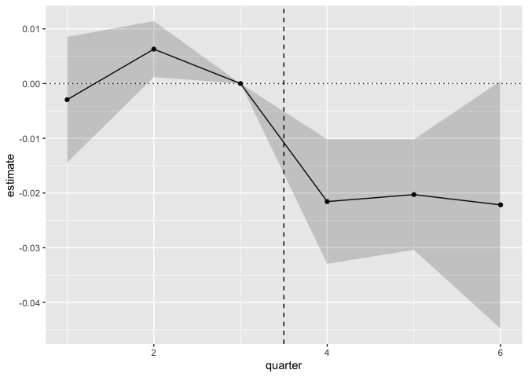

# chaper4


# 前準備

``` r
library(tidyverse)
```

    ── Attaching core tidyverse packages ──────────────────────── tidyverse 2.0.0 ──
    ✔ dplyr     1.1.4     ✔ readr     2.1.5
    ✔ forcats   1.0.0     ✔ stringr   1.5.1
    ✔ ggplot2   3.5.1     ✔ tibble    3.2.1
    ✔ lubridate 1.9.3     ✔ tidyr     1.3.1
    ✔ purrr     1.0.2     
    ── Conflicts ────────────────────────────────────────── tidyverse_conflicts() ──
    ✖ dplyr::filter() masks stats::filter()
    ✖ dplyr::lag()    masks stats::lag()
    ℹ Use the conflicted package (<http://conflicted.r-lib.org/>) to force all conflicts to become errors

``` r
URL_ORGAN_SHORT <- "https://raw.githubusercontent.com/HirotakeIto/intro_to_impact_evaluation_with_python/main/data/ch4_organ_donations_short.csv"
URL_ORGAN_FULL <- "https://raw.githubusercontent.com/HirotakeIto/intro_to_impact_evaluation_with_python/main/data/ch4_organ_donations_full.csv"
```

# DID の発想に基づく施策効果分析

#### プログラム4.1 DID の発想に基づく施策効果分析

``` r
df_organ_donations_short <- read_csv(URL_ORGAN_SHORT)
```

    Rows: 54 Columns: 7
    ── Column specification ────────────────────────────────────────────────────────
    Delimiter: ","
    chr (2): State, Quarter
    dbl (5): Rate, Quarter_Num, IsTreatmentGroup, AfterTreatment, IsTreatment

    ℹ Use `spec()` to retrieve the full column specification for this data.
    ℹ Specify the column types or set `show_col_types = FALSE` to quiet this message.

``` r
df_organ_donations_short
```

    # A tibble: 54 × 7
       State   Quarter  Rate Quarter_Num IsTreatmentGroup AfterTreatment IsTreatment
       <chr>   <chr>   <dbl>       <dbl>            <dbl>          <dbl>       <dbl>
     1 Alaska  Q22011  0.77            3                0              0           0
     2 Alaska  Q32011  0.78            4                0              1           0
     3 Arizona Q22011  0.226           3                0              0           0
     4 Arizona Q32011  0.250           4                0              1           0
     5 Califo… Q22011  0.274           3                1              0           0
     6 Califo… Q32011  0.264           4                1              1           1
     7 Colora… Q22011  0.674           3                0              0           0
     8 Colora… Q32011  0.672           4                0              1           0
     9 Connec… Q22011  0.395           3                0              0           0
    10 Connec… Q32011  0.403           4                0              1           0
    # ℹ 44 more rows

``` r
df_organ_donations_short |>
  group_by(IsTreatmentGroup, AfterTreatment) |>
  summarise(
    rate_mean = mean(Rate)
  )
```

    `summarise()` has grouped output by 'IsTreatmentGroup'. You can override using
    the `.groups` argument.

    # A tibble: 4 × 3
    # Groups:   IsTreatmentGroup [2]
      IsTreatmentGroup AfterTreatment rate_mean
                 <dbl>          <dbl>     <dbl>
    1                0              0     0.449
    2                0              1     0.460
    3                1              0     0.274
    4                1              1     0.264

``` r
df_organ_donations_short |>
  group_by(IsTreatmentGroup, AfterTreatment) |>
  summarise(
    rate_mean = mean(Rate)
  ) |>
  pivot_wider(
    names_from = c(IsTreatmentGroup, AfterTreatment),
    values_from = rate_mean
  ) |>
  summarise(
    `result_%` = 100 * ((`1_1` - `1_0`) - (`0_1` - `0_0`))
  )
```

    `summarise()` has grouped output by 'IsTreatmentGroup'. You can override using
    the `.groups` argument.

    # A tibble: 1 × 1
      `result_%`
           <dbl>
    1      -2.16

#### プログラム4.2 DID による訴求内容変更施策の分析

``` r
library(broom)
library(estimatr)

df_organ_donations_short <- read_csv(URL_ORGAN_SHORT)
```

    Rows: 54 Columns: 7
    ── Column specification ────────────────────────────────────────────────────────
    Delimiter: ","
    chr (2): State, Quarter
    dbl (5): Rate, Quarter_Num, IsTreatmentGroup, AfterTreatment, IsTreatment

    ℹ Use `spec()` to retrieve the full column specification for this data.
    ℹ Specify the column types or set `show_col_types = FALSE` to quiet this message.

``` r
df_organ_donations_short |>
  estimatr::lm_robust(
    Rate ~ IsTreatment + State + factor(Quarter_Num),
    clusters = State,
    se_type = "stata",
    data = _,
  ) |>
  broom::tidy()
```

                            term    estimate    std.error     statistic
    1                (Intercept)  0.76956731 3.548978e-03  2.168420e+02
    2                IsTreatment -0.02156538 7.097955e-03 -3.038253e+00
    3               StateArizona -0.53680000 4.141492e-16 -1.296151e+15
    4            StateCalifornia -0.49526731 3.548978e-03 -1.395521e+02
    5              StateColorado -0.10245000 4.468745e-16 -2.292590e+14
    6           StateConnecticut -0.37585000 4.159671e-16 -9.035570e+14
    7  StateDistrict of Columbia -0.42625000 4.138805e-16 -1.029887e+15
    8               StateFlorida -0.36860000 4.226606e-16 -8.720946e+14
    9                StateHawaii -0.34675000 5.305522e-16 -6.535643e+14
    10            StateLouisiana -0.19660000 4.137704e-16 -4.751428e+14
    11             StateMaryland -0.31155000 4.475881e-16 -6.960641e+14
    12             StateMichigan -0.55580000 4.170747e-16 -1.332615e+15
    13            StateMinnesota -0.25260000 4.214775e-16 -5.993202e+14
    14             StateMissouri -0.36740000 4.223098e-16 -8.699774e+14
    15              StateMontana -0.11195000 4.819429e-16 -2.322889e+14
    16             StateNebraska -0.33675000 4.445959e-16 -7.574293e+14
    17        StateNew Hampshire -0.22615000 4.498132e-16 -5.027643e+14
    18           StateNew Jersey -0.46760000 5.546780e-16 -8.430117e+14
    19             StateNew York -0.63675000 4.142415e-16 -1.537147e+15
    20       StateNorth Carolina -0.24200000 4.213135e-16 -5.743942e+14
    21                 StateOhio -0.20490000 4.224604e-16 -4.850159e+14
    22         StatePennsylvania -0.31940000 4.154655e-16 -7.687763e+14
    23       StateSouth Carolina -0.51515000 4.217216e-16 -1.221540e+15
    24            StateTennessee -0.43450000 4.809579e-16 -9.034055e+14
    25             StateVirginia -0.42275000 4.137624e-16 -1.021722e+15
    26           StateWashington -0.18860000 4.210382e-16 -4.479404e+14
    27            StateWisconsin -0.20460000 4.210744e-16 -4.858998e+14
    28              StateWyoming -0.18260000 4.138020e-16 -4.412738e+14
    29      factor(Quarter_Num)4  0.01086538 7.097955e-03  1.530777e+00
            p.value     conf.low    conf.high df outcome
    1  6.953367e-44  0.762272280  0.776862336 26    Rate
    2  5.362415e-03 -0.036155440 -0.006975329 26    Rate
    3  0.000000e+00 -0.536800000 -0.536800000 26    Rate
    4  6.524119e-39 -0.502562336 -0.487972280 26    Rate
    5  0.000000e+00 -0.102450000 -0.102450000 26    Rate
    6  0.000000e+00 -0.375850000 -0.375850000 26    Rate
    7  0.000000e+00 -0.426250000 -0.426250000 26    Rate
    8  0.000000e+00 -0.368600000 -0.368600000 26    Rate
    9  0.000000e+00 -0.346750000 -0.346750000 26    Rate
    10 0.000000e+00 -0.196600000 -0.196600000 26    Rate
    11 0.000000e+00 -0.311550000 -0.311550000 26    Rate
    12 0.000000e+00 -0.555800000 -0.555800000 26    Rate
    13 0.000000e+00 -0.252600000 -0.252600000 26    Rate
    14 0.000000e+00 -0.367400000 -0.367400000 26    Rate
    15 0.000000e+00 -0.111950000 -0.111950000 26    Rate
    16 0.000000e+00 -0.336750000 -0.336750000 26    Rate
    17 0.000000e+00 -0.226150000 -0.226150000 26    Rate
    18 0.000000e+00 -0.467600000 -0.467600000 26    Rate
    19 0.000000e+00 -0.636750000 -0.636750000 26    Rate
    20 0.000000e+00 -0.242000000 -0.242000000 26    Rate
    21 0.000000e+00 -0.204900000 -0.204900000 26    Rate
    22 0.000000e+00 -0.319400000 -0.319400000 26    Rate
    23 0.000000e+00 -0.515150000 -0.515150000 26    Rate
    24 0.000000e+00 -0.434500000 -0.434500000 26    Rate
    25 0.000000e+00 -0.422750000 -0.422750000 26    Rate
    26 0.000000e+00 -0.188600000 -0.188600000 26    Rate
    27 0.000000e+00 -0.204600000 -0.204600000 26    Rate
    28 0.000000e+00 -0.182600000 -0.182600000 26    Rate
    29 1.379022e-01 -0.003724671  0.025455440 26    Rate

# 2 期間以上のデータの場合の DID

#### プログラム4.3 DID による多期間データの分析

``` r
library(broom)
library(estimatr)

df_organ_donations_full <- read_csv(URL_ORGAN_FULL)
```

    Rows: 162 Columns: 7
    ── Column specification ────────────────────────────────────────────────────────
    Delimiter: ","
    chr (2): State, Quarter
    dbl (5): Rate, Quarter_Num, IsTreatmentGroup, AfterTreatment, IsTreatment

    ℹ Use `spec()` to retrieve the full column specification for this data.
    ℹ Specify the column types or set `show_col_types = FALSE` to quiet this message.

``` r
df_organ_donations_full |>
  estimatr::lm_robust(
    Rate ~ IsTreatment + State + factor(Quarter_Num),
    clusters = State,
    se_type = "stata",
    data = _,
  ) |>
  broom::tidy()
```

                            term     estimate    std.error     statistic
    1                (Intercept)  0.765547056 5.190062e-03  1.475025e+02
    2                IsTreatment -0.022458974 6.720766e-03 -3.341729e+00
    3               StateArizona -0.532866667 7.017536e-16 -7.593359e+14
    4            StateCalifornia -0.495037179 3.360383e-03 -1.473157e+02
    5              StateColorado -0.105483333 6.132095e-16 -1.720184e+14
    6           StateConnecticut -0.380183333 6.226595e-16 -6.105799e+14
    7  StateDistrict of Columbia -0.430050000 7.781612e-16 -5.526490e+14
    8               StateFlorida -0.376950000 6.121172e-16 -6.158134e+14
    9                StateHawaii -0.352416667 6.749297e-16 -5.221532e+14
    10            StateLouisiana -0.216733333 6.117559e-16 -3.542807e+14
    11             StateMaryland -0.307616667 6.411424e-16 -4.797946e+14
    12             StateMichigan -0.540866667 7.838924e-16 -6.899756e+14
    13            StateMinnesota -0.245716667 6.249258e-16 -3.931934e+14
    14             StateMissouri -0.365983333 6.472590e-16 -5.654357e+14
    15              StateMontana -0.118450000 6.792498e-16 -1.743836e+14
    16             StateNebraska -0.330816667 7.041260e-16 -4.698259e+14
    17        StateNew Hampshire -0.229200000 6.409075e-16 -3.576179e+14
    18           StateNew Jersey -0.460750000 6.701660e-16 -6.875162e+14
    19             StateNew York -0.643550000 7.575716e-16 -8.494907e+14
    20       StateNorth Carolina -0.248350000 6.347066e-16 -3.912831e+14
    21                 StateOhio -0.207733333 6.793436e-16 -3.057854e+14
    22         StatePennsylvania -0.319050000 6.437920e-16 -4.955793e+14
    23       StateSouth Carolina -0.504283333 6.919558e-16 -7.287797e+14
    24            StateTennessee -0.438133333 6.122021e-16 -7.156678e+14
    25             StateVirginia -0.432383333 6.726616e-16 -6.427947e+14
    26           StateWashington -0.186316667 6.471168e-16 -2.879182e+14
    27            StateWisconsin -0.201216667 6.794499e-16 -2.961464e+14
    28              StateWyoming -0.182333333 6.471958e-16 -2.817282e+14
    29      factor(Quarter_Num)2 -0.002396296 5.705411e-03 -4.200042e-01
    30      factor(Quarter_Num)3  0.004866667 5.298319e-03  9.185303e-01
    31      factor(Quarter_Num)4  0.015765147 7.109509e-03  2.217473e+00
    32      factor(Quarter_Num)5  0.011639221 5.775128e-03  2.015405e+00
    33      factor(Quarter_Num)6  0.016842925 1.269650e-02  1.326580e+00
            p.value     conf.low    conf.high df outcome
    1  1.547558e-39  0.754878731  0.776215381 26    Rate
    2  2.529765e-03 -0.036273706 -0.008644243 26    Rate
    3  0.000000e+00 -0.532866667 -0.532866667 26    Rate
    4  1.599329e-39 -0.501944545 -0.488129814 26    Rate
    5  0.000000e+00 -0.105483333 -0.105483333 26    Rate
    6  0.000000e+00 -0.380183333 -0.380183333 26    Rate
    7  0.000000e+00 -0.430050000 -0.430050000 26    Rate
    8  0.000000e+00 -0.376950000 -0.376950000 26    Rate
    9  0.000000e+00 -0.352416667 -0.352416667 26    Rate
    10 0.000000e+00 -0.216733333 -0.216733333 26    Rate
    11 0.000000e+00 -0.307616667 -0.307616667 26    Rate
    12 0.000000e+00 -0.540866667 -0.540866667 26    Rate
    13 0.000000e+00 -0.245716667 -0.245716667 26    Rate
    14 0.000000e+00 -0.365983333 -0.365983333 26    Rate
    15 0.000000e+00 -0.118450000 -0.118450000 26    Rate
    16 0.000000e+00 -0.330816667 -0.330816667 26    Rate
    17 0.000000e+00 -0.229200000 -0.229200000 26    Rate
    18 0.000000e+00 -0.460750000 -0.460750000 26    Rate
    19 0.000000e+00 -0.643550000 -0.643550000 26    Rate
    20 0.000000e+00 -0.248350000 -0.248350000 26    Rate
    21 0.000000e+00 -0.207733333 -0.207733333 26    Rate
    22 0.000000e+00 -0.319050000 -0.319050000 26    Rate
    23 0.000000e+00 -0.504283333 -0.504283333 26    Rate
    24 0.000000e+00 -0.438133333 -0.438133333 26    Rate
    25 0.000000e+00 -0.432383333 -0.432383333 26    Rate
    26 0.000000e+00 -0.186316667 -0.186316667 26    Rate
    27 0.000000e+00 -0.201216667 -0.201216667 26    Rate
    28 0.000000e+00 -0.182333333 -0.182333333 26    Rate
    29 6.779331e-01 -0.014123937  0.009331344 26    Rate
    30 3.667844e-01 -0.006024184  0.015757518 26    Rate
    31 3.553881e-02  0.001151342  0.030378953 26    Rate
    32 5.430876e-02 -0.000231725  0.023510168 26    Rate
    33 1.961823e-01 -0.009255102  0.042940952 26    Rate

#### プログラム4.4 イベントスタディによる多期間データの分析

``` r
df_organ_donations_full <- read_csv(URL_ORGAN_FULL)
```

    Rows: 162 Columns: 7
    ── Column specification ────────────────────────────────────────────────────────
    Delimiter: ","
    chr (2): State, Quarter
    dbl (5): Rate, Quarter_Num, IsTreatmentGroup, AfterTreatment, IsTreatment

    ℹ Use `spec()` to retrieve the full column specification for this data.
    ℹ Specify the column types or set `show_col_types = FALSE` to quiet this message.

``` r
df_organ_donations_full |>
  mutate(
    QuarterNum_1 = if_else(Quarter_Num == 1, 1, 0),
    QuarterNum_2 = if_else(Quarter_Num == 2, 1, 0),
    QuarterNum_4 = if_else(Quarter_Num == 4, 1, 0),
    QuarterNum_5 = if_else(Quarter_Num == 5, 1, 0),
    QuarterNum_6 = if_else(Quarter_Num == 6, 1, 0),
    Quarter_Num = factor(Quarter_Num),
  ) |>
  estimatr::lm_robust(
    Rate ~
      QuarterNum_1:IsTreatmentGroup +
      QuarterNum_2:IsTreatmentGroup +
      QuarterNum_4:IsTreatmentGroup +
      QuarterNum_5:IsTreatmentGroup +
      QuarterNum_6:IsTreatmentGroup +
      State +
      Quarter_Num,
    clusters = State,
    se_type = "stata",
    data = _,
  ) |>
  broom::tidy() -> result
```

``` r
missing_standard <- tribble(
  ~estimate, ~ conf.low, ~conf.high, ~quarter,
  0, 0, 0, 3
)

result |>
  select(term, estimate, conf.low, conf.high) |>
  mutate(
    quarter = case_when(
      term == "QuarterNum_1:IsTreatmentGroup" ~ 1,
      term == "IsTreatmentGroup:QuarterNum_2" ~ 2,
      term == "IsTreatmentGroup:QuarterNum_4" ~ 4,
      term == "IsTreatmentGroup:QuarterNum_5" ~ 5,
      term == "IsTreatmentGroup:QuarterNum_6" ~ 6,
      TRUE ~ NA
    )
  ) |>
  select(-term) |>
  filter(!is.na(quarter)) |>
  add_row(missing_standard) |>
  ggplot(aes(x = quarter, y = estimate)) +
  geom_point() +
  geom_line() +
  geom_ribbon(aes(ymin = conf.low, ymax = conf.high), alpha = 0.2) +
  geom_hline(yintercept = 0, linetype = "dotted") +
  geom_vline(xintercept = 3.5, linetype = "dashed")
```



# パラレルトレンド仮説と検証

#### プログラム4.5 グラフィカルな図によるプレトレンドテスト

``` r
df_organ_donations_full <- read_csv(URL_ORGAN_FULL)
```

    Rows: 162 Columns: 7
    ── Column specification ────────────────────────────────────────────────────────
    Delimiter: ","
    chr (2): State, Quarter
    dbl (5): Rate, Quarter_Num, IsTreatmentGroup, AfterTreatment, IsTreatment

    ℹ Use `spec()` to retrieve the full column specification for this data.
    ℹ Specify the column types or set `show_col_types = FALSE` to quiet this message.

``` r
df_organ_donations_full |>
  group_by(IsTreatmentGroup, Quarter_Num) |>
  summarise(
    Rate_mean = mean(Rate)
  ) |>
  mutate(
    IsTreatmentGroup = factor(IsTreatmentGroup)
  ) |>
  ggplot(
    aes(
      x = Quarter_Num,
      y = Rate_mean,
      group = IsTreatmentGroup,
      linetype = IsTreatmentGroup
      )
  ) +
  geom_line() +
  geom_vline(xintercept = 3.5, linetype = "dashed") +
  coord_cartesian(
    ylim = c(0, 0.6)
  )
```

    `summarise()` has grouped output by 'IsTreatmentGroup'. You can override using
    the `.groups` argument.


