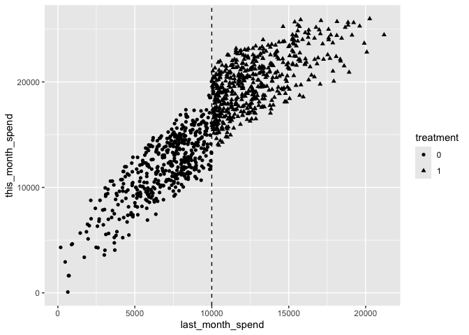
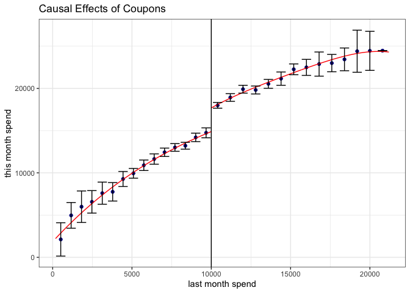
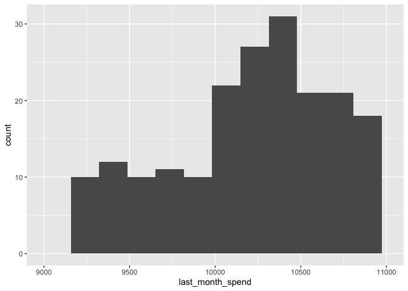
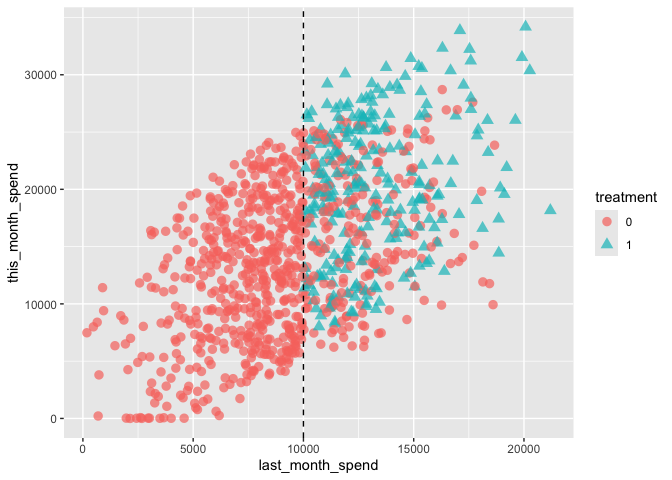

# Regression Discontinuity Designを用いて効果検証を行う


# 前準備

``` r
library(tidyverse)
```

    ── Attaching core tidyverse packages ──────────────────────── tidyverse 2.0.0 ──
    ✔ dplyr     1.1.4     ✔ readr     2.1.5
    ✔ forcats   1.0.0     ✔ stringr   1.5.1
    ✔ ggplot2   3.5.1     ✔ tibble    3.2.1
    ✔ lubridate 1.9.3     ✔ tidyr     1.3.1
    ✔ purrr     1.0.2     
    ── Conflicts ────────────────────────────────────────── tidyverse_conflicts() ──
    ✖ dplyr::filter() masks stats::filter()
    ✖ dplyr::lag()    masks stats::lag()
    ℹ Use the conflicted package (<http://conflicted.r-lib.org/>) to force all conflicts to become errors

``` r
URL_COUPON <- "https://raw.githubusercontent.com/HirotakeIto/intro_to_impact_evaluation_with_python/main/data/ch5_coupon.csv"
URL_COUPON_V2 <- "https://raw.githubusercontent.com/HirotakeIto/intro_to_impact_evaluation_with_python/main/data/ch5_coupon_v2.csv"
```

# RDD が適用できるシチュエーション

## クーポン配布施策：クーポンの効果は本当に大きいのか？

### 太郎くんの分析を再現するコード

``` r
df_coupon <- read_csv(URL_COUPON)
```

    Rows: 1000 Columns: 5
    ── Column specification ────────────────────────────────────────────────────────
    Delimiter: ","
    dbl (5): last_month_spend, this_month_spend, sex, age, treatment

    ℹ Use `spec()` to retrieve the full column specification for this data.
    ℹ Specify the column types or set `show_col_types = FALSE` to quiet this message.

``` r
df_coupon |>
  mutate(
    treatment = factor(treatment)
  ) |>
  ggplot(
    aes(
      x = last_month_spend, y = this_month_spend,
      group = treatment,
      shape = treatment
      )) +
  geom_point() +
  geom_vline(xintercept = 10000, linetype = "dashed")
```



#### 先月と今月の売り上げの集計

``` r
df_coupon |>
  group_by(treatment) |>
  summarise(
    last_month_spend = mean(last_month_spend),
    this_month_spend = mean(this_month_spend),
  )
```

    # A tibble: 2 × 3
      treatment last_month_spend this_month_spend
          <dbl>            <dbl>            <dbl>
    1         0            6889.           11869.
    2         1           12729.           19956.

# Sharp RDD の仮定と推定

## rdrobust パッケージを用いた Sharp RDD の推定の実装

#### プログラム5.1 Sharp RDD の推定

``` r
library(rdrobust)

df_coupon <- read_csv(URL_COUPON)
```

    Rows: 1000 Columns: 5
    ── Column specification ────────────────────────────────────────────────────────
    Delimiter: ","
    dbl (5): last_month_spend, this_month_spend, sex, age, treatment

    ℹ Use `spec()` to retrieve the full column specification for this data.
    ℹ Specify the column types or set `show_col_types = FALSE` to quiet this message.

``` r
result_rdd <- rdrobust::rdrobust(
  y = df_coupon$this_month_spend,
  x = df_coupon$last_month_spend,
  c = 10000,
  all = TRUE,
)
summary(result_rdd)
```

    Sharp RD estimates using local polynomial regression.

    Number of Obs.                 1000
    BW type                       mserd
    Kernel                   Triangular
    VCE method                       NN

    Number of Obs.                  474          526
    Eff. Number of Obs.             275          344
    Order est. (p)                    1            1
    Order bias  (q)                   2            2
    BW est. (h)                3142.296     3142.296
    BW bias (b)                5102.400     5102.400
    rho (h/b)                     0.616        0.616
    Unique Obs.                     457          508

    =============================================================================
            Method     Coef. Std. Err.         z     P>|z|      [ 95% C.I. ]       
    =============================================================================
      Conventional  2751.575   362.113     7.599     0.000  [2041.846 , 3461.303]  
    Bias-Corrected  2709.109   362.113     7.481     0.000  [1999.380 , 3418.837]  
            Robust  2709.109   434.318     6.238     0.000  [1857.860 , 3560.357]  
    =============================================================================

``` r
rdplot(
  y = df_coupon$this_month_spend,
  x = df_coupon$last_month_spend,
  binselect = "es",
  c = 10000,
  ci = 95,
  title = "Causal Effects of Coupons",
  y.label = "this month spend",
  x.label = "last month spend",
)
```



## McCrary の検定の実装

#### プログラム5.2 McCrary の検定

``` r
df_coupon = read_csv(URL_COUPON)
```

    Rows: 1000 Columns: 5
    ── Column specification ────────────────────────────────────────────────────────
    Delimiter: ","
    dbl (5): last_month_spend, this_month_spend, sex, age, treatment

    ℹ Use `spec()` to retrieve the full column specification for this data.
    ℹ Specify the column types or set `show_col_types = FALSE` to quiet this message.

``` r
ggplot(
  df_coupon,
  aes(x = last_month_spend)
) +
  geom_histogram(binwidth = 165) +
  xlim(c(9000, 11000))
```

    Warning: Removed 795 rows containing non-finite outside the scale range
    (`stat_bin()`).

    Warning: Removed 2 rows containing missing values or values outside the scale range
    (`geom_bar()`).



``` r
library(rddensity)

rddensity::rddensity(
  X = df_coupon$last_month_spend,
  c = 10000
) |>
  summary()
```


    Manipulation testing using local polynomial density estimation.

    Number of obs =       1000
    Model =               unrestricted
    Kernel =              triangular
    BW method =           estimated
    VCE method =          jackknife

    c = 10000             Left of c           Right of c          
    Number of obs         474                 526                 
    Eff. Number of obs    126                 234                 
    Order est. (p)        2                   2                   
    Order bias (q)        3                   3                   
    BW est. (h)           1654.604            1945.856            

    Method                T                   P > |T|             
    Robust                3.3305              9e-04               

    Warning in summary.CJMrddensity(rddensity::rddensity(X =
    df_coupon$last_month_spend, : There are repeated observations. Point estimates
    and standard errors have been adjusted. Use option massPoints=FALSE to suppress
    this feature.


    P-values of binomial tests (H0: p=0.5).

    Window Length              <c     >=c    P>|T|
    343.000   + 343.000        20      57    0.0000
    488.734   + 521.095        28      86    0.0000
    634.468   + 699.190        38     108    0.0000
    780.201   + 877.285        51     125    0.0000
    925.935   + 1055.380       57     152    0.0000
    1071.669  + 1233.475       71     171    0.0000
    1217.403  + 1411.571       85     190    0.0000
    1363.136  + 1589.666       97     210    0.0000
    1508.870  + 1767.761      106     222    0.0000
    1654.604  + 1945.856      126     234    0.0000

## 共変量のバランステストの実装

#### プログラム5.3 共変量のバランステスト

``` r
library(rdrobust)

df_coupon <- read_csv(URL_COUPON)
```

    Rows: 1000 Columns: 5
    ── Column specification ────────────────────────────────────────────────────────
    Delimiter: ","
    dbl (5): last_month_spend, this_month_spend, sex, age, treatment

    ℹ Use `spec()` to retrieve the full column specification for this data.
    ℹ Specify the column types or set `show_col_types = FALSE` to quiet this message.

``` r
result_sex <- rdrobust(
  y = df_coupon$sex,
  x = df_coupon$last_month_spend,
  c = 10000,
)

result_age <- rdrobust(
  y = df_coupon$age,
  x = df_coupon$last_month_spend,
  c = 10000,
)

tribble(
  ~X, ~`RD Effect`, ~`Robust p-val`,
  "sex", as.numeric(result_sex$Estimate[1, "tau.us"]), result_sex$pv[2,],
  "age", as.numeric(result_age$Estimate[1, "tau.us"]), result_age$pv[2,],
)
```

    # A tibble: 2 × 3
      X     `RD Effect` `Robust p-val`
      <chr>       <dbl>          <dbl>
    1 sex        0.0107          0.916
    2 age        0.668           0.974

# Fuzzy RDD：処置確率が閾値によって不連続的に変化する場合の RDD

## rdrobust を用いた Fuzzy RDD の推定の実装

#### プログラム5.4 Fuzzy RDD の推定

``` r
df_coupon_v2 <- read_csv(URL_COUPON_V2)
```

    Rows: 1000 Columns: 3
    ── Column specification ────────────────────────────────────────────────────────
    Delimiter: ","
    dbl (3): last_month_spend, this_month_spend, treatment

    ℹ Use `spec()` to retrieve the full column specification for this data.
    ℹ Specify the column types or set `show_col_types = FALSE` to quiet this message.

``` r
df_coupon_v2 |>
  mutate(
    treatment = factor(treatment)
  ) |>
  ggplot(
    aes(
      x = last_month_spend, y = this_month_spend,
      group = treatment,
      shape = treatment,
      color = treatment,
    )
  ) +
  geom_point(size = 3, alpha = 0.7) +
  geom_vline(xintercept = 10000, linetype = "dashed")
```



``` r
df_coupon_v2 <- read_csv(URL_COUPON_V2)
```

    Rows: 1000 Columns: 3
    ── Column specification ────────────────────────────────────────────────────────
    Delimiter: ","
    dbl (3): last_month_spend, this_month_spend, treatment

    ℹ Use `spec()` to retrieve the full column specification for this data.
    ℹ Specify the column types or set `show_col_types = FALSE` to quiet this message.

``` r
result_fuzzy_rdd <- rdrobust::rdrobust(
  y = df_coupon_v2$this_month_spend,
  x = df_coupon_v2$last_month_spend,
  fuzzy = df_coupon_v2$treatment,
  c = 10000,
  all = TRUE
)

summary(result_fuzzy_rdd)
```

    Fuzzy RD estimates using local polynomial regression.

    Number of Obs.                 1000
    BW type                       mserd
    Kernel                   Triangular
    VCE method                       NN

    Number of Obs.                  528          472
    Eff. Number of Obs.             258          219
    Order est. (p)                    1            1
    Order bias  (q)                   2            2
    BW est. (h)                2316.239     2316.239
    BW bias (b)                3543.243     3543.243
    rho (h/b)                     0.654        0.654
    Unique Obs.                     505          462

    First-stage estimates.

    =============================================================================
            Method     Coef. Std. Err.         z     P>|z|      [ 95% C.I. ]       
    =============================================================================
      Conventional     0.455     0.073     6.238     0.000     [0.312 , 0.598]     
    Bias-Corrected     0.444     0.073     6.085     0.000     [0.301 , 0.587]     
            Robust     0.444     0.088     5.042     0.000     [0.272 , 0.617]     
    =============================================================================

    Treatment effect estimates.

    =============================================================================
            Method     Coef. Std. Err.         z     P>|z|      [ 95% C.I. ]       
    =============================================================================
      Conventional  6531.230  2645.630     2.469     0.014  [1345.890 , 11716.571] 
    Bias-Corrected  6671.425  2645.630     2.522     0.012  [1486.085 , 11856.765] 
            Robust  6671.425  3179.184     2.098     0.036   [440.340 , 12902.510] 
    =============================================================================
